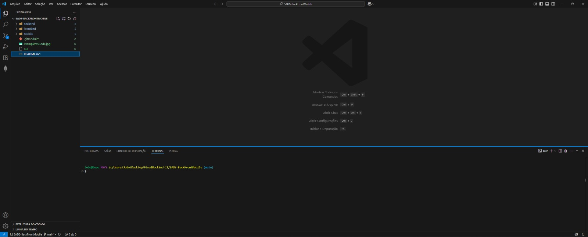
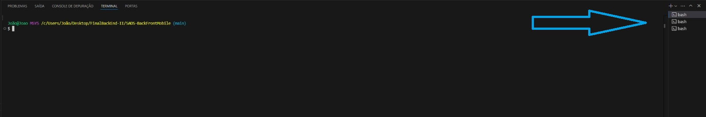
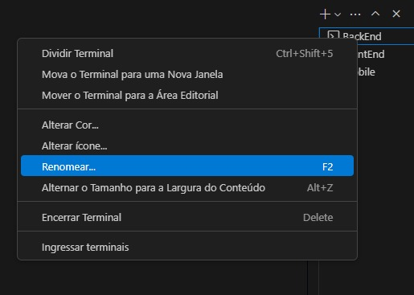

# Trabalho final

Repositório destinado ao projeto para final da matéria de BackEnd do quinto período de ADS, onde será adicionado uma nova funcionalidade o leilão de serviços e será feita a melhoria na agenda já implementada.

### Link para os repositorios originais:

 - [BackEnd](https://github.com/samuelmuzy/Handyman-back)
 - [FrontEnd](https://github.com/samuelmuzy/HandymanFront)
 - [Mobile](https://github.com/uVictorA/HandmanAPP2)

### Instruções:

Para executar este projeto, baixe e instale o [VSCode](https://code.visualstudio.com/download), o [Node.js](https://nodejs.org/pt/download), [Git](https://git-scm.com/downloads/win) e o [ExpoGo](https://play.google.com/store/apps/details?id=host.exp.exponent) no seu celular.

Apos as instalações, crie uma pasta na sua area de trabalho, ou qualquer outra pasta que preferir, clique com o botao direito e selecione a opção "open git bash here", se voce estiver usando o Windows 11 ela pode esta "escondida" no "mostrar mais opções". Agora execute o seguinte comando ele ira fazer um clone do repositorio para o seu computador.

```bash
  git clone https://github.com/JoaoASouzaN/5ADS-BackFrontMobile.git
```
Em seguida, com o GitBash ainda aberto, use o comando:
```bash
  code .
```
Ele deve aprir o VSCode para você.

Com o VSCode aberto aperte as teclas **ctrl+shift+"**, este é o atalho para criar um novo terminal, o qual estara aberto na porção inferiror do VSCode. (Exemplo na imagem 1 a seguir):



No terminal, execute os seguites comandos e aguarde até finalizar a instalação das dependencias do BackEnd.
```bash
  cd BackEnd/
  npm install
```
Em seguida, execute estes outros comandos e aguarde até finalizar a instalação das dependencias do FrontEnd.
```bash
  cd ../FrontEnd/
  npm install
```
E por ultimo, execute estes comandos e aguarde até finalizar a instalação das dependencias do Mobile.
```bash
  cd ../Mobile/
  npm install
```
Ao instalar todas as dependencias você ja podera executar o projeto. Para isso, inicie outros dois terminais usando o comando **ctrl+shift+"**, você vai poder navegar por eles ao clicar em um deles na lateral direita do terminal (Exemplo na imagem 2). Por padrao eles vem nomeados de forma generica, para uma maior organização voce pode renomea los clicando com o botao direito no nome do terminal. (Exemplo na imagem 3)




